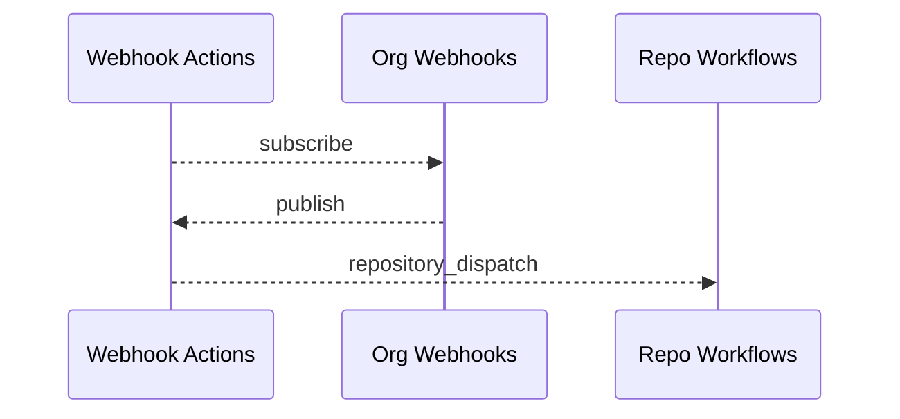

# Webhook Actions GitHub App

Transforms your organization's webhook events into streamlined repository dispatches. With support for over 250+ events, dispatching Actions across repositories has never been easier or more secure. No need to worry about managing Personal Access Tokens, our app ensures secure dispatches every time.

See it in the [GitHub Marketplace](https://github.com/marketplace/webhook-actions).

Also, be sure to check out the [Webhook Actions Playground beta](https://nimbusxr.github.io/webhook-actions/). This tool will help you validate your event configurations.

## How it works



## Installation

Install Webhook Actions app and select the repositories which should receive dispatches and any repositories that you
want reporting repository events.

## Configuration

### Repository

To enable event dispatch subscription on a repository you must have a configuration file
at `.github/webhook-actions/config.json`.

```yaml
{
  "events": {
    "team_created": {
       # ...
    },
    "team_deleted": {
       # ...
    }
  }
}
```

### Organization

To prevent unauthorized access to events across your organization's repositories it is strongly recommended to use this
configuration. You must create a repository named `webhook-actions-config`. Then create a file
named `repositories.json`. In the example that follows, we are adding a repo configuration for the repos
named `super-awesome-app` and `not-so-awesome-app`.

```yaml
{
  "super-awesome-app": {
    "events": {
      "team_created": {
        # ...
      }
    }
  },
  "not-so-awesome-app": {
    "events": {
      "team_deleted": {
        # ...
      }
    }
  }
}
```

An organization config will override all individual repository configs if the json provides an object (even an empty
object).

### Filter

Filtering is possible in an event configuration. To view all available notation please
visit [sift](https://www.npmjs.com/package/sift). An example below shows a configuration setup to filter, inclusively,
any teams created prefixed with the word `test`.

```yaml
{
  "events": {
    "team_created": {
      "filter": {
        "team.name": {
          "$regex": "^test.*$"
        }
      }
    }
  }
}
```

The entire payload can be filtered on minus action and installation, both of which are removed from the forwarded
payload.
See [GitHub Webhook events and Payloads](https://docs.github.com/en/developers/webhooks-and-events/webhooks/webhook-events-and-payloads).

### Map

Mapping is possible in an event configuration. The example below illustrates how to use dot notation along with [GitHub
Actions expression syntax](https://docs.github.com/en/actions/learn-github-actions/expressions), as the value, to the
new map. You can only use **one expression per value**. As with filtering, you may only access the event payload minus
the action and installation.

```yaml
{
  "events": {
    "team_created": {
      "map": {
        "name": "Team Created",
        "team": "${{ team.name }}",
        "parent": "${{ team.parent.name }}"
      }
    }
  }
}

```

## Usage

The following example, used in a GitHub Actions workflow, would trigger a workflow every time a new team is created or
deleted in your organization.

```yaml
on:
  repository_dispatch:
    types:
      - team_created
      - team_deleted
```

See [Supported Events](supported-events.md).

See [Examples](./examples).

## Rate Limiting

Rate limiting adheres
to [GitHub Apps Rate Limits](https://docs.github.com/en/developers/apps/building-github-apps/rate-limits-for-github-apps).
In addition caching is used to minimize requests for installation, account, and Webhook Actions configs on each
repository.

Any event fired from a workflow dispatched by Webhook Actions will also be ignored.

## Plans

### Free

Limited to three repositories and one webhook event per repository. A configuration that has multiple `events` listed
will default to using the **first event**. Unfortunately we cannot control order of repositories, so you must ensure you
only have the application installed to a max of three repositories. You can update this by going to
your `Organization Settings -> Third-pary Access: GitHub Apps -> Webhook Actions: Configure -> Only select repositories`
and ensuring that you again only have a max of three repositories selected.

### Pro (Personal)

A per repository plan for personal repositories coming soon.

### Pro (Organization)

A per repository plan for organization repositories coming soon.

### Enterprise

A flat rate plan for organizations with 20+ repositories coming soon.
